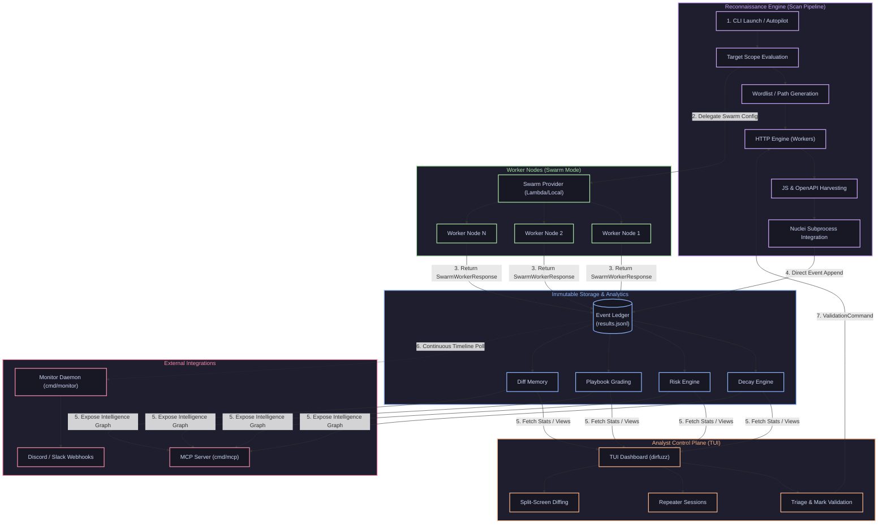

# DirFuzz: Bug Bounty Intelligence OS

<p align="center">
  
</p>

DirFuzz has evolved from a high-performance web security fuzzer into a deterministic **Bug Bounty Intelligence Operating System**. It is built around an immutable Event Ledger, capable of projecting complex attack surface graphs, continuous regression tracking, playbook intelligence, and deterministic Analyst workflows.

## The Architecture

DirFuzz enforces a strict intelligence pipeline:



### Key Architectural Pillars

1. **Evidence History**: Append-mode JSONL retains scan discoveries; TUI sidecar state can restore analyst workspace elements. A unified durable typed-event ledger and complete campaign recovery remain roadmap work.
2. **Deterministic Projections**: Campaign graph and comparison primitives are designed for replayable outputs. Full crash-safe event persistence and end-to-end replay are not yet implemented.
3. **Analyst Control Plane**: The system never executes autonomous blind loops. Intelligence suggests actions via `PlaybookSuggestions`, but Analysts retain ultimate execution rights (`ValidationCommand`), closing the human-in-the-loop lifecycle.
4. **Regression & Diff Memory**: Campaign comparisons detect status, size, content-type, normalized-body-hash, and risk-score changes. Diff-memory structures support analyst decisions; durable cross-campaign persistence is still planned.
5. **Knowledge Decay**: Intelligence organically decays via an exponential half-life model. A `403` discovered 2 years ago naturally fades in priority, preventing stale API intelligence from poisoning modern queues.
6. **Playbook Efficacy Grading**: The intelligence layer self-audits, measuring Playbook confirmed yields against false positives (e.g., IDOR_CHECK yields 13% bugs) to influence suggestion ranking organically.
7. **Explainable Campaign Risk**: Generates high-level posture overviews tracking Attack Surface Growth, Auth Boundary Changes, and Critical Findings—backed by explicitly traceable `RiskReasons`.


> **v4.0.3 implementation status:** HTTP scanning and JSONL/TUI history are operational features. `pkg/campaign` contains campaign intelligence primitives, but its `EventStore` is currently an interface and `BuildFromLedger` handles selected event types. Treat full durable campaign replay, multi-backend storage, and cross-session knowledge persistence as roadmap items, not release guarantees.

## Included Components

- `cmd/dirfuzz`: The main CLI Analyst Control Plane (TUI) and scanning engine interface.
- `cmd/monitor`: The continuous campaign monitoring and baseline evaluator.
- `cmd/mcp`: The MCP server for scoped AI-assisted workflows.
- `pkg/engine`: The underlying deterministic execution and HTTP workers.
- `pkg/campaign`: The Campaign Intelligence Projection, Risk Engine, and Playbook ecosystem.
- `pkg/knowledge`: The Memory mapping, Decay Engine, and Analyst Decision hierarchy.

## Core Scanning Capabilities

Despite its OS-level architecture, the underlying HTTP engine retains all standard capabilities:
- Fast HTTP/1.1 and HTTP/2 scanning with connection pooling and proxy support.
- Smart filtering: status, size, word/line, regex, response-time, AutoFilter, and SimHash suppression.
- WAF handling and Headless anti-bot fallbacks.
- Recursive wildcards, JS/OpenAPI route harvesting, and generic JSON API response extraction.
- Hidden parameter fuzzing, chunked probing, and timing-oracle enumeration.
- Native Nuclei orchestrator subprocess integration (`--nuclei`).
- Opt-in distributed execution via Swarm mode (`--swarm`).

## Installation

### Method 1: Build from Source (Go Developers)
The current Go module is named `dirfuzz` and uses local module replacements; clone the repository before building. The old remote `go install github.com/...@latest` example is not supported by this module layout.
```bash
git clone https://github.com/tobiasGuta/Dirfuzz.git
cd Dirfuzz
go build -o dirfuzz ./cmd/dirfuzz
go build -o dirfuzz-monitor ./cmd/monitor
go build -o dirfuzz-mcp ./cmd/mcp
```

### Method 2: Pre-compiled Binaries
You can download pre-compiled archives (containing all three tools) for Linux, macOS, and Windows from the [Releases](https://github.com/tobiasare/dirfuzz/releases) page. Extract the archive and place the binaries in your system's PATH.

## Build

Requirements: Go 1.25.0 or newer (as declared in `go.mod`).

```bash
go build -o dirfuzz ./cmd/dirfuzz
go build -o dirfuzz-monitor ./cmd/monitor
go build -o dirfuzz-mcp ./cmd/mcp
```

## Quick Start (Analyst Workflows)

### 1. Basic Intelligence Collection
```bash
./dirfuzz -u https://example.com -w wordlists/common.txt
```

### 2. Campaign Baseline & Append Mode (Recommended)
```bash
./dirfuzz -u https://example.com -w wordlists/common.txt -o results.jsonl --history-mode append --save-raw
```
In `append` mode, DirFuzz retains prior scan results in `results.jsonl` and restores supported TUI state from a sidecar file. This is not yet a full typed campaign-event ledger or a guarantee of complete crash recovery.

### 3. Safe Authenticated Routing with Pruning
```bash
./dirfuzz -u https://app.example.com -w wordlists/common.txt \
  --auth admin="Cookie: session=A" \
  --exclude-path "(?i)logout|delete|destroy|reset"
```

### 4. Headless Ledger Generation
```bash
./dirfuzz -u https://example.com -w wordlists/common.txt --no-tui -o results.jsonl
```

### 5. Swarm Distributed Execution
```bash
./dirfuzz -u https://example.com -w wordlists/common.txt --swarm --swarm-nodes 8
```

## TUI: Analyst Control Plane

The Terminal UI is the primary interface for Intelligence Validation.

- `Enter`: Open Hit Details and Playbook Suggestions.
- `h` / `H`: Open Raw Request/Response Hex Views.
- `Tab`: Toggle Request/Response.
- `R`: Save Response as Reference.
- `d` / `D`: Split-screen Diffing against saved reference.
- `r`: Send to Repeater Session.
- `[` / `]`: Cycle Repeater Sessions.
- `Ctrl+Y` / `Alt+Y`: Copy Request / Response to Clipboard.
- `Alt+C`: Generate `curl` command.
- `L`: Toggle Live Event Ledger logs.
- `1` - `5`: Cycle Analytics Dashboards (Campaign Risk, Playbook Metrics, Graph Health).
- `t`: Triage / Mark finding for validation.
- `a`: Anomaly-Only filtering mode.

## Monitoring and MCP

- **`cmd/monitor`**: Run background timelines continuously, computing Diff Severities and triggering webhooks on high-risk regression.
- **`cmd/mcp`**: Exposes the Analyst Graph via standard MCP protocol. Features strict Scope evaluation (`DIRFUZZ_SCOPE_DIR`) and explicit Approval Tokens (`DIRFUZZ_SCAN_APPROVAL_TOKEN`) protecting execution boundaries.

## Docker Deployment
```bash
cp .env.example .env
docker compose up --build -d
```
